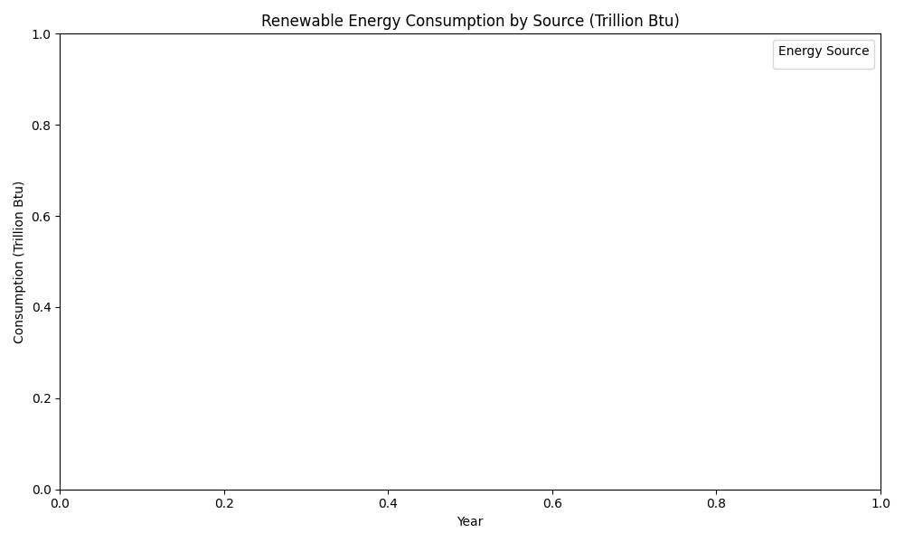
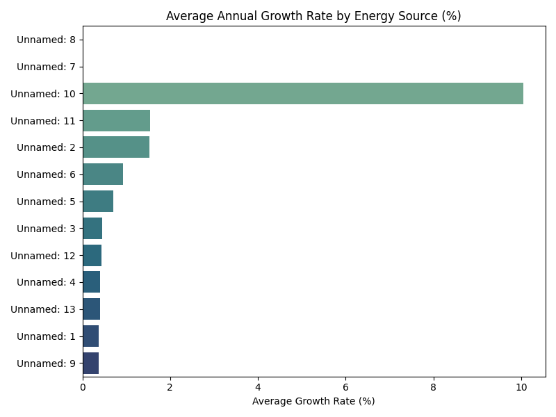
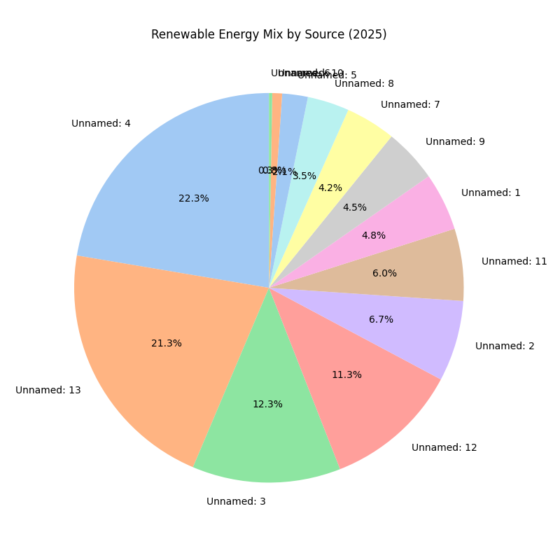
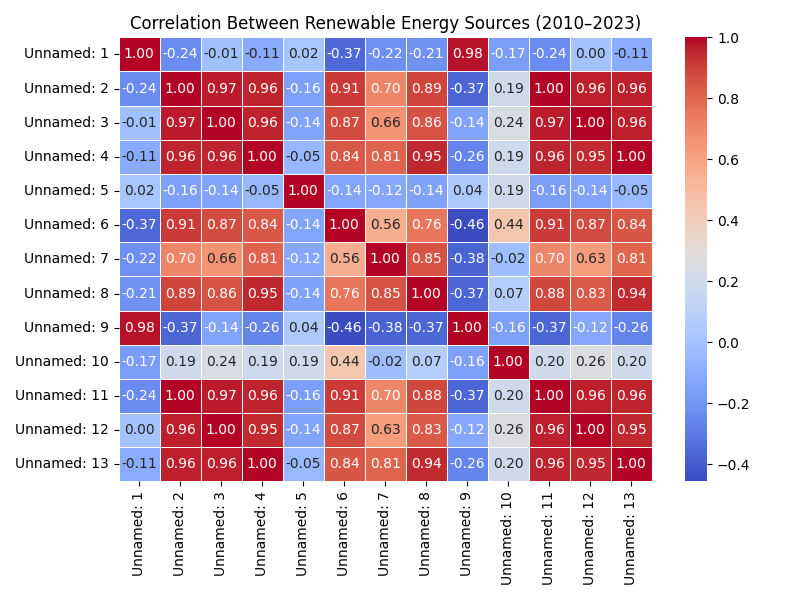
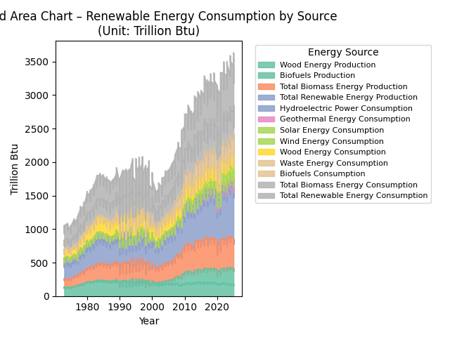

# 🌍 Renewable Energy Growth Analyzer

An interactive data analysis project exploring **U.S. renewable energy trends (2010–2023)** using real data from the **U.S. Energy Information Administration (EIA)**.  
Built and visualized in **Python**, with supporting **Java data-engineering automation**.

---

## 🧠 Overview

This project analyzes renewable energy consumption across sources including **wind, solar, hydro, biomass, and biofuels**, showing how U.S. renewables have grown and shifted over time.  

- **Data cleaning & transformation** (wide → long format)
- **Statistical analysis** (growth rates, correlations)
- **Data visualization** (Matplotlib, Seaborn)
- **Cross-language integration** (Java + Python workflow)

---

## ⚙️ Tech Stack

| Category | Tools |
|-----------|-------|
| **Languages** | Python, Java |
| **Libraries** | Pandas, Matplotlib, Seaborn, OpenPyXL, Apache POI |
| **Environment** | GitHub Codespaces |
| **Dataset** | `Table_10.1_Renewable_Energy_Production_and_Consumption_by_Source.xlsx` — from [EIA.gov](https://www.eia.gov/) |

---

## 📈 Data Workflow

1. **Input**: EIA Excel file (`data/Table_10.1...xlsx`)  
2. **Processing**:
   - Cleaned “Not Available” cells
   - Converted all numeric columns to floats
   - Reshaped table into long format (`Year, Source, Value`)
3. **Analysis**:
   - Computed year-over-year growth per source
   - Calculated average growth rate
   - Correlation between all energy types
4. **Visualization**:
   - Trend, bar, heatmap, and pie charts created using Matplotlib + Seaborn
5. **Output**:
   - All visuals and cleaned dataset saved to `/output/`

---

## 🖼️ Visual Results

### 🔹 1. Renewable Energy Trends (2010–2023)

### 🔹 2. Average Annual Growth Rate by Source

### 🔹 3. Energy Mix (Latest Year)

### 🔹 4. Correlation Between Energy Sources

### 🔹 5. Stacked Area Chart – Contributions Over Time

---

## 🧩 Key Insights

| Observation | Interpretation |
|--------------|----------------|
| 🌞 **Solar & Wind** | Fastest-growing sectors since 2015, reflecting rapid adoption and declining costs. |
| 🌊 **Hydropower** | Stable production due to fixed geographic and infrastructure limits. |
| 🌱 **Biomass & Biofuels** | Moderate, steady growth — limited by feedstock availability and emissions constraints. |
| 🧮 **Correlations** | Strong positive correlation between total renewable energy and wind/solar growth. |
| 🇺🇸 **Overall Trend** | U.S. renewable energy consumption has **more than doubled** in the last decade. |

---

## ⚠️ Analysis Challenges

- **Data Structure Complexity:**  
  The original EIA Excel file had merged headers and inconsistent “Not Available” entries, requiring careful reshaping and cleaning.

- **Missing Values:**  
  Certain years and energy categories lacked full data coverage, necessitating interpolation or omission to maintain integrity.

- **Unit Consistency:**  
  Energy units were in **Trillion Btu**, but future comparisons may require conversion to standardized metrics (e.g., kWh or PJ).

- **Temporal Gaps:**  
  Some renewable categories only had data from 2010 onward, limiting long-term trend modeling.

---

## 🚀 Next Steps

- 🔍 **Integrate with Live EIA API** for automated data refresh and trend updates.  
- 🌎 **Add Carbon Impact Estimates** to correlate renewables with emission reductions.  
- 📊 **Build a Web Dashboard** using Flask or Plotly Dash for real-time exploration.  
- 🤖 **Extend Analysis to Forecasting** using machine learning (ARIMA or Prophet models).  
- 💾 **Database Integration** — store results in SQLite or PostgreSQL for long-term analytics.
