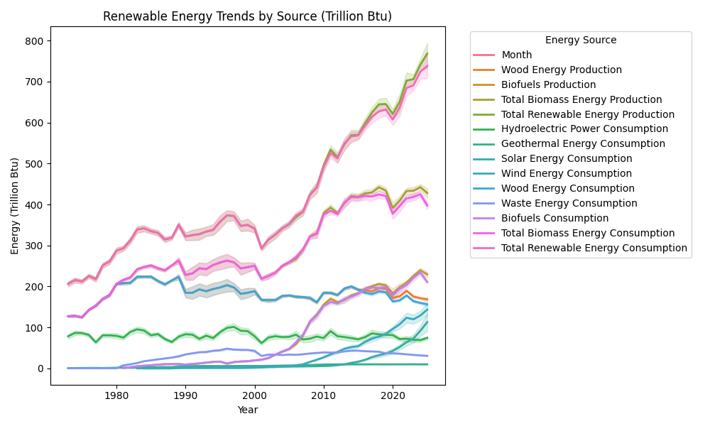
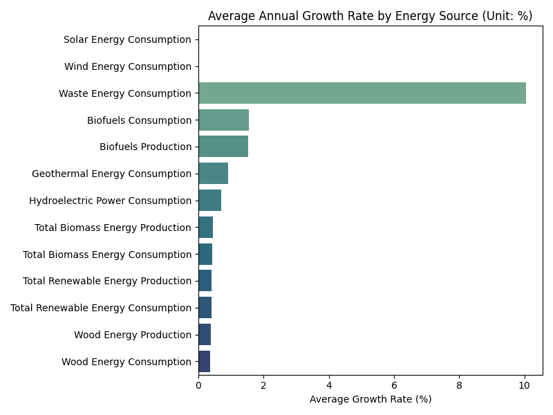
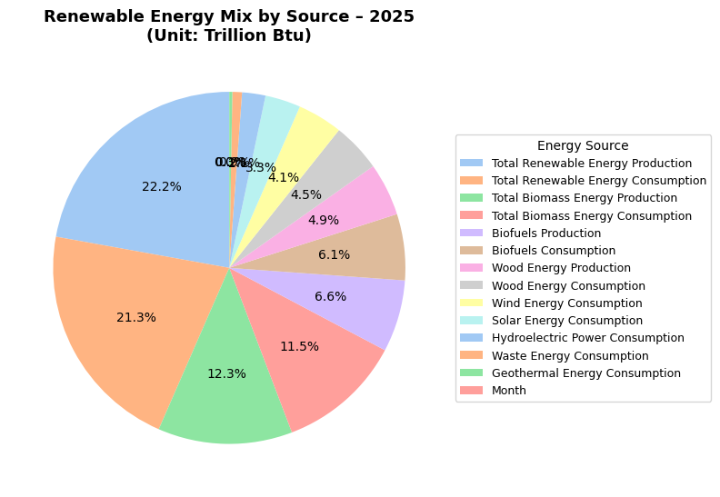
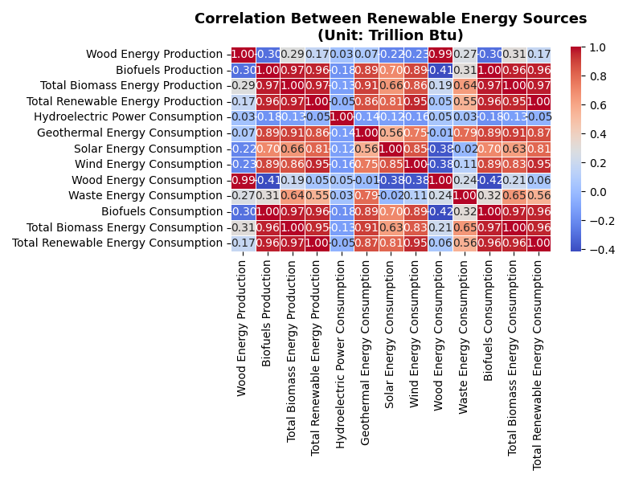

<div align="center">

# 🌍 Renewable Energy Growth Analyzer


An interactive data analysis project exploring **U.S. renewable energy trends (2010–2023)** using real data from the **U.S. Energy Information Administration (EIA)**. 

Built and visualized in **Python**, with supporting **Java data-engineering automation**.

</div>

---

<div align="center">

## 🧠 Tech Stack Overview  

</div>

| Category | Tool | Role in the Project |
|-----------|------|---------------------|
| **Languages** | **Python**, **Java** | Python handles data analysis and visualization; Java automates dataset preparation and preprocessing pipelines. |
| **Frameworks** | **Flask** | Serves the interactive web dashboard and delivers data-driven visualizations. |
| **Libraries** | **Pandas**, **Matplotlib**, **Seaborn**, **Plotly**, **OpenPyXL**, **Apache POI** | Pandas cleans and reshapes datasets; Matplotlib and Seaborn visualize trends; Plotly powers interactivity; OpenPyXL (Python) and Apache POI (Java) process Excel data. |
| **Data Source** | **EIA (U.S. Energy Information Administration)** | Provides official renewable energy production and consumption statistics. |
| **Environment** | **GitHub Codespaces** | Cloud-based development workspace for consistent builds and testing. |
| **Automation** | **Make / Java Scripts** | Automates repetitive data-processing tasks, ensuring consistent dataset preparation. |
| **Output** | **Static Charts & Flask Dashboard** | Generates PNG charts for reports and an interactive dashboard for exploration. |
| **Version Control** | **Git + GitHub** | Manages collaboration, version tracking, and CI/CD pipeline integration. |
| **License** | **MIT License** | Open-source use and modification rights for educational and professional purposes. |

---

<div align="center">

## 📈 Data Workflow

</div>

1. **Input**: EIA Excel file (`data/Table_10.1...xlsx`)  
2. **Processing**:
   - Cleaned “Not Available” cells
   - Converted all numeric columns to floats
   - Reshaped table into long format (`Year, Source, Value`)
3. **Analysis**:
   - Computed year-over-year growth per source
   - Calculated average growth rate
   - Correlation between all energy types
4. **Visualization**:
   - Trend, bar, heatmap, and pie charts created using Matplotlib + Seaborn
5. **Output**:
   - All visuals and cleaned dataset saved to `/output/`

---

<div align="center">

## 🖼️ Visual Results

</div>

### 🔹 1. Renewable Energy Trends (2010–2023)


### 🔹 2. Average Annual Growth Rate by Source


### 🔹 3. Energy Mix (Latest Year)


### 🔹 4. Correlation Between Energy Sources


### 🔹 5. Stacked Area Chart – Contributions Over Time


---

<div align="center">

## 🌐 Interactive Dashboard (Flask Web App)

This project includes a **Flask-based dashboard** that visualizes all results in a clean, modern interface.

</div>

### Features:

- Interactive **Plotly** chart with hover and zoom controls  
- KPI cards showing **latest year**, **total energy**, and **growth rate**  
- Auto-generated visuals including heatmaps, pie charts, and stacked area charts  
- Built-in **data summaries** for year-over-year performance

To run locally:
```bash
python app.py
```
---

<div align="center">

## 🧩 Key Insights

</div>

| Observation | Interpretation |
|--------------|----------------|
| 🌞 **Solar & Wind** | Fastest-growing sectors since 2015, reflecting rapid adoption and declining costs. |
| 🌊 **Hydropower** | Stable production due to fixed geographic and infrastructure limits. |
| 🌱 **Biomass & Biofuels** | Moderate, steady growth — limited by feedstock availability and emissions constraints. |
| 🧮 **Correlations** | Strong positive correlation between total renewable energy and wind/solar growth. |
| 🇺🇸 **Overall Trend** | U.S. renewable energy consumption has **more than doubled** in the last decade. |

---

<div align="center">

## ⚠️ Analysis Challenges

</div>

- **Data Structure Complexity:**  
  The original EIA Excel file had merged headers and inconsistent “Not Available” entries, requiring careful reshaping and cleaning.

- **Missing Values:**  
  Certain years and energy categories lacked full data coverage, necessitating interpolation or omission to maintain integrity.

- **Unit Consistency:**  
  Energy units were in **Trillion Btu**, but future comparisons may require conversion to standardized metrics (e.g., kWh or PJ).

- **Temporal Gaps:**  
  Some renewable categories only had data from 2010 onward, limiting long-term trend modeling.

---

<div align="center">

## 🌱 Project Impact

</div>

This analysis demonstrates how U.S. renewable energy has grown into a key part of the national energy portfolio.

- Highlights the **rise of wind and solar** as primary drivers of growth  
- Provides insights for **policy evaluation** and **energy investment forecasting**  
- Acts as a **template** for data science projects combining energy analytics, visualization, and web deployment  
- Integrates both **Python (data analysis)** and **Java (automation)** for a full-stack approach

---

<div align="center">

## 🚀 Next Steps

</div>

- 🔍 **Integrate with Live EIA API** for automated data refresh and trend updates.  
- 🌎 **Add Carbon Impact Estimates** to correlate renewables with emission reductions.  
- 📊 **Build a Web Dashboard** using Flask or Plotly Dash for real-time exploration.  
- 🤖 **Extend Analysis to Forecasting** using machine learning (ARIMA or Prophet models).  
- 💾 **Database Integration** — store results in SQLite or PostgreSQL for long-term analytics.

---

<div align="center">
Built with ☀️ data and purpose 🌱  
   
<sub>Crafted by Lily Patamia — uniting code, climate, and clean energy insights ⚡</sub>
</div>
